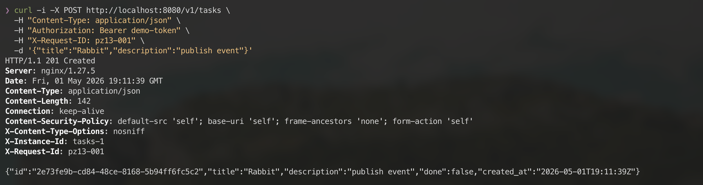
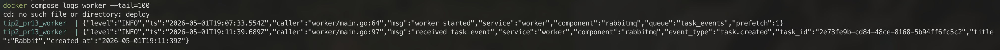
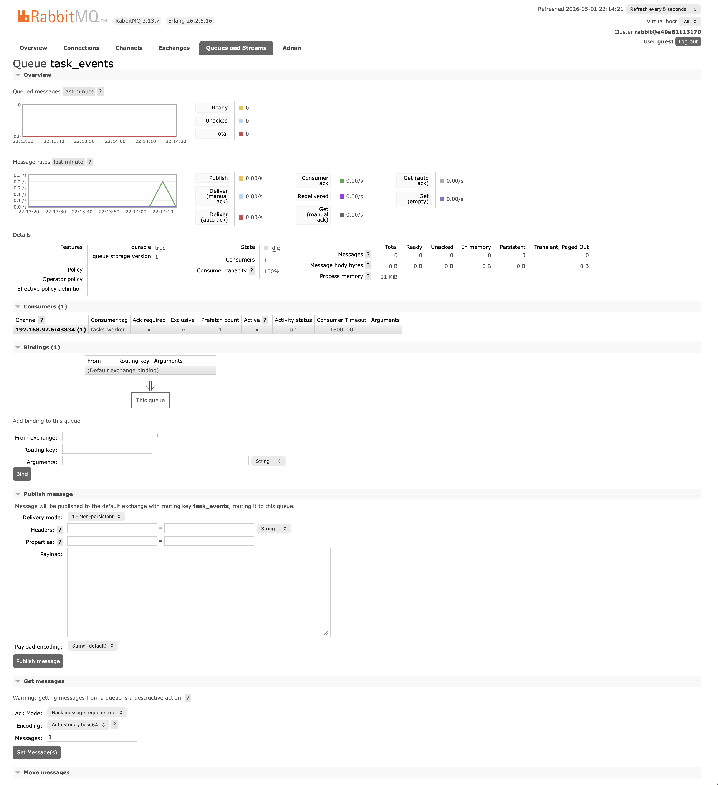

# Практическое занятие №13

## Рузин Иван Александрович ЭФМО-01-25

### Подключение к RabbitMQ. Отправка и получение сообщений

## Сборка и запуск проекта

```bash
cd deploy
cp .env.example .env
docker compose up -d --build
```

### 1. Как поднят RabbitMQ (docker-compose) и какие порты используются

RabbitMQ поднимается через `docker compose` из файла `deploy/docker-compose.yml`
сервисом `rabbitmq` на образе `rabbitmq:3.13-management-alpine`.

Используемые порты:

- `5672` - AMQP-подключение для producer и consumer;
- `15672` - Management UI RabbitMQ.

Фрагмент `deploy/docker-compose.yml`:

```yaml
rabbitmq:
  image: rabbitmq:3.13-management-alpine
  container_name: tip2_rabbitmq
  environment:
    RABBITMQ_DEFAULT_USER: "${RABBITMQ_DEFAULT_USER}"
    RABBITMQ_DEFAULT_PASS: "${RABBITMQ_DEFAULT_PASS}"
  ports:
    - "${RABBITMQ_PORT}:5672"
    - "${RABBITMQ_MANAGEMENT_PORT}:15672"
  healthcheck:
    test: ["CMD-SHELL", "rabbitmq-diagnostics -q ping"]
```

Проверка запуска контейнеров:


### 2. Какой формат сообщения (JSON поля) и почему

Формат события - JSON:

- `type` - тип события;
- `task_id` - идентификатор созданной задачи;
- `title` - заголовок задачи;
- `created_at` - время создания задачи.

Структура события находится в `services/tasks/internal/service/service.go`:

```go
type TaskEvent struct {
    Type      string `json:"type"`
    TaskID    string `json:"task_id"`
    Title     string `json:"title"`
    CreatedAt string `json:"created_at"`
}
```

Пример сообщения:

```json
{
  "type": "task.created",
  "task_id": "task-1",
  "title": "Rabbit",
  "created_at": "2026-05-01T18:30:00Z"
}
```

Сообщение содержит только данные, нужные consumer'у для реакции на факт создания
задачи.

### 3. Где именно в tasks публикуется сообщение

Публикация выполняется в `TaskService.Create` после успешного создания задачи
через `repo.Create(...)`.

Фрагмент из `services/tasks/internal/service/service.go`:

```go
task, err := s.repo.Create(ctx, repository.CreateTaskParams{
    Title:       title,
    Description: sanitizePlainText(input.Description),
    DueDate:     dueDate,
})
if err != nil {
    return Task{}, err
}

dto := toTaskDTO(task)
s.publishTaskCreated(ctx, dto)

return dto, nil
```

Сначала задача сохраняется в БД, затем публикуется событие `task.created`. Если
RabbitMQ недоступен, задача не откатывается, ошибка публикации логируется.

AMQP-публикация реализована в `services/tasks/internal/events/rabbitmq.go` через
`PublishWithContext`. Очередь объявляется с `durable=true`, сообщение
отправляется с `DeliveryMode: amqp.Persistent`.

### 4. Как устроен worker и где делается ack

Worker находится в `services/worker/cmd/worker/main.go`.

Он:

- подключается к RabbitMQ;
- объявляет очередь `task_events`;
- выставляет `prefetch` через `Qos`;
- читает сообщения с `autoAck=false`;
- при успешной обработке вызывает `delivery.Ack(false)`;
- при невалидном JSON вызывает `delivery.Nack(false, false)`.

Фрагмент consumer-логики:

```go
if err := ch.Qos(prefetch, 0, false); err != nil {
    logger.Fatal("set prefetch failed", zap.Error(err))
}

deliveries, err := ch.Consume(
    queueName,
    "tasks-worker",
    false,
    false,
    false,
    false,
    nil
)
if err != nil {
    logger.Fatal("consume queue failed", zap.Error(err))
}

for delivery := range deliveries {
    handleDelivery(logger, delivery)
}
```

Ack выполняется после успешного разбора JSON и логирования события:

```go
if err := delivery.Ack(false); err != nil {
    logger.Warn("ack task event failed", zap.Error(err))
}
```

`prefetch=1` означает, что worker берет только одно неподтвержденное сообщение
за раз.

### 5. Минимальная демонстрация: команда POST и лог worker'а

POST-запрос на создание задачи:

```bash
curl -i -X POST http://localhost:8080/v1/tasks \
  -H "Content-Type: application/json" \
  -H "Authorization: Bearer demo-token" \
  -H "X-Request-ID: pz13-001" \
  -d '{"title":"Rabbit","description":"publish event"}'
```

Ожидаемый результат:

- сервис `tasks` возвращает `201 Created`;
- `tasks` публикует событие в очередь `task_events`;
- `worker` выводит лог `received task event`;
- после обработки вызывается `ack`.

Скриншот POST-запроса:



Логи worker с полученным событием:



Очередь `task_events` в RabbitMQ UI:



## Как тестируется

Автотесты:

```bash
GOCACHE=/tmp/tip2_go_cache go test ./...
```

Проверка docker-compose:

```bash
cd deploy
docker compose --env-file .env config
```

Ручная проверка:

1. Запустить проект: `docker compose up -d --build`.
2. Выполнить `POST /v1/tasks`.
3. Проверить HTTP-ответ `201 Created`.
4. Проверить логи worker: `docker compose logs -f worker`.
5. Открыть RabbitMQ UI: `http://localhost:15672`, логин/пароль `guest`/`guest`.

## Контрольные вопросы

**Зачем нужен брокер сообщений, если есть HTTP?**

Брокер нужен для асинхронной обработки, буферизации нагрузки, повторной доставки
сообщений и уменьшения связности между сервисами.

**Что такое ack и зачем он нужен?**

`ack` - подтверждение успешной обработки сообщения. После `ack` RabbitMQ удаляет
сообщение из очереди.

**Почему возможна повторная доставка сообщения?**

Если consumer получил сообщение, но завершился до `ack`, RabbitMQ считает
сообщение необработанным и может доставить его повторно.

**Что делает prefetch?**

`prefetch` ограничивает количество неподтвержденных сообщений, которые RabbitMQ
может одновременно отдать consumer'у.

**Чем очередь durable отличается от non-durable?**

`durable` очередь сохраняется после перезапуска RabbitMQ. `non-durable` очередь
после перезапуска пропадает.
